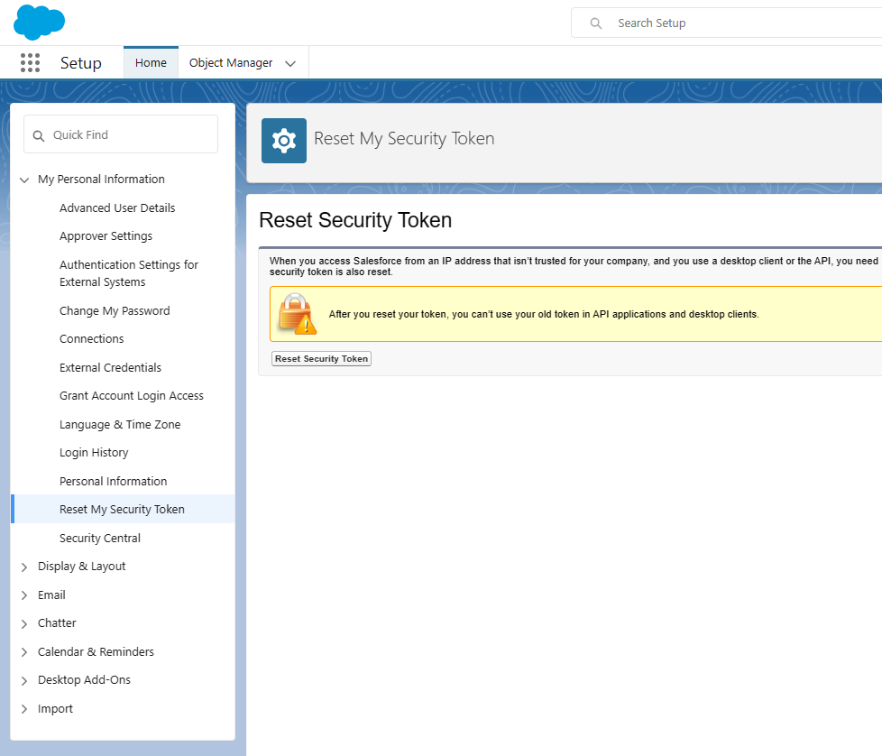

# Donations tools for Salesforce NPSP (Nonprofit Success Package)

This Python code provides some bacic tools for the following use cases:

1. Command line app that receives as an input text and searches the Salesforce CRM for matches. It also calculates a basic relevance score and provides the top 5 results based on this score. This app uses Salesforce SOSL queries to execute the search.

2. Gets an Excel file as input and based on the email for each contact, it adds a new column with the contact ID that is found querying Salesforce (if it finds one matching contact)

3. Upload donations to Salesforce from an Excel file, using the contact ID and all the donation information (type, amount, category, etc)

All these use cases use the simple_salesforce Python package to access Salesforce NPSP CRM (Nonprofit Success Package)


# Salesforce access configuration

To configure Salesforce secret you'll need to create a mysecrets.py file with the following format:

```
# Salesforce credentials
client_id = <your client id>
client_secret = <your client secret>
username = '<your salesforce username'
password = '<your salesforce password>'
security_token = '<your security token>'
```

To obtain the Salesforce security token, please select similar option from the user settings:

